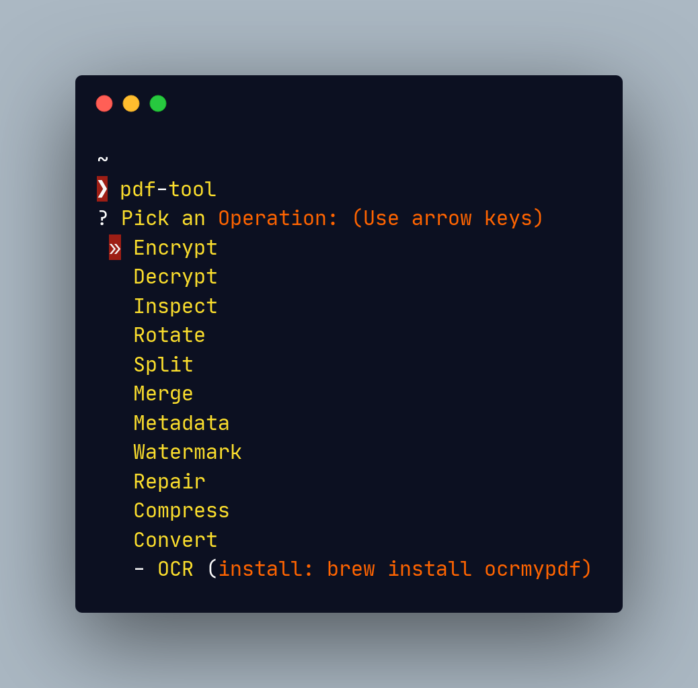

# pdf-tool

Interactive wizard CLI for everyday PDF manipulation — encrypt, decrypt, split, merge, rotate, compress, inspect, OCR, watermark, edit metadata, repair, convert — aimed at terminal-curious users on macOS and Linux.



## Install

```bash
curl -fsSL https://raw.githubusercontent.com/antirubber/pdf-tool/master/install.sh | sh
```

The installer figures out the rest: it detects your OS and package manager
(Homebrew, apt, dnf, pacman), installs the core system dependencies
(`ghostscript`, `poppler`, `img2pdf`) only if they're missing, then installs
`pdf-tool` itself with `uv` (preferring `pipx` if present, bootstrapping `uv`
if neither is). It installs the latest published release (falling back to the
`master` branch before the first release is cut), and does nothing if you're
already up to date. It never runs as root: anything that needs `sudo` is
printed for you to run yourself rather than executed silently.

Preview exactly what it would do without changing anything:

```bash
curl -fsSL https://raw.githubusercontent.com/antirubber/pdf-tool/master/install.sh | sh -s -- --dry-run
```

<details>
<summary>Prefer to install by hand?</summary>

```bash
# macOS
brew install ghostscript poppler img2pdf && uv tool install git+https://github.com/antirubber/pdf-tool.git

# Debian/Ubuntu
sudo apt-get install -y ghostscript poppler-utils img2pdf && uv tool install git+https://github.com/antirubber/pdf-tool.git
```

`pipx install git+…` works anywhere `uv tool install` does.
</details>

## Usage

```bash
pdf-tool                # launch the wizard
pdf-tool update         # update to the latest release
pdf-tool --version      # show version
pdf-tool --debug        # show raw backend output and tracebacks
```

The wizard presents a menu of operations, prompts for what it needs, and exits. No subcommands, no flags to memorize.

Operations whose required backends are missing appear greyed-out with install hints.

## System dependencies

| Operation | Needs | Install |
|---|---|---|
| Compress | Ghostscript | `brew install ghostscript` |
| Convert (Office ↔ PDF) | LibreOffice | `brew install libreoffice` |
| Convert (PDF → images) | poppler | `brew install poppler` |
| Convert (PDF → text) | poppler | `brew install poppler` |
| Convert (images → PDF) | img2pdf | `brew install img2pdf` |
| OCR | ocrmypdf | `brew install ocrmypdf` |

Encrypt, decrypt, split, merge, rotate, inspect, watermark, metadata, and repair need only `pikepdf` (installed automatically with the package).

Compress runs Ghostscript with `-dSAFER`. **Ghostscript 9.50 or newer is recommended** — older releases have weaker sandboxing even with `-dSAFER`, and the Wizard warns at startup when it detects an older version.

## Development

```bash
uv sync --dev           # create venv, install runtime + dev deps
uv run pytest           # run tests
uv run pdf-tool         # run from source
make reinstall          # rebuild + reinstall the tool (clears uv cache)
```

## License

MIT
